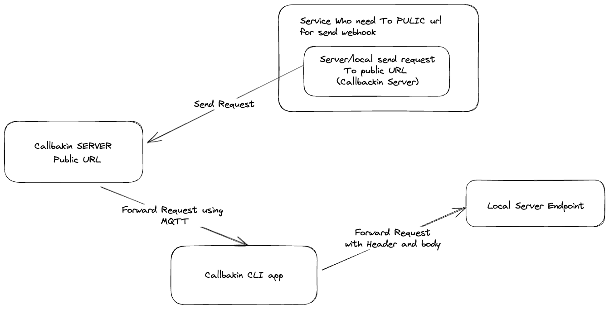

# CALLBACKIN

## Description
Callbackin is a simple solution that allows you to forward requests from a public URL to a local server. It is particularly useful for testing webhooks and other services that require a public URL to receive requests.

## Usage
1. Install the `callbackin` package globally using pip: `pip install callbackin` or `pip3 install callbackin`.
2. Initialize Callbackin by running the command: `callbackin init` just fill with default value.
3. Login to Callbackin using GitHub by running the command: `callbackin login`.
4. Create a new callback by running the command: `callbackin create`, and provide the necessary details:
   ```bash
   $ callbackin create
   Name of the callback: Callback 2
   Local endpoint: http://localhost:8000/handle-error
   Description: Simple Local Handle error
   ```
   This will create a callback named "Callback 2" for the local endpoint "http://localhost:8000/handle-error". It will also generate a unique public URL that can be used to send requests to your endpoint:
   ```
   Creating callback Callback 2 for http://localhost:8000/handle-error
   Using This URL to use your endpoint: https://api.callbackin.my.id/handle/2b4edbf0-3c71-473c-97ad-1c34978ca7f9
   Start callback with this command: callbackin run 10
   ```
   Copy the generated URL and use it as the destination for your requests.
5. List all created callbacks by running the command: `callbackin list`.
6. Start listening for requests on a specific callback by running the command: `callbackin run {ID}`.

## Commands
- `callbackin init`: Initializes the Callbackin server.
- `callbackin login`: Logs in to Callbackin using GitHub.
- `callbackin create`: Creates a new callback.
- `callbackin list`: Lists all created callbacks.
- `callbackin run {ID}`: Starts listening for requests on a specific callback.

## How it works
Callbackin utilizes a public server to forward requests from a public URL to a local server. It achieves this by generating a unique public URL using a UUID. When a request is sent to the public URL, the server forwards the request to the associated local server using MQTT (Message Queuing Telemetry Transport).
The Callbackin CLI (Command-Line Interface) is used to create callbacks and listen for MQTT messages. When a request is received, the server sends an MQTT message to the CLI. The CLI then forwards the request to the local server for processing.

## Diagram

