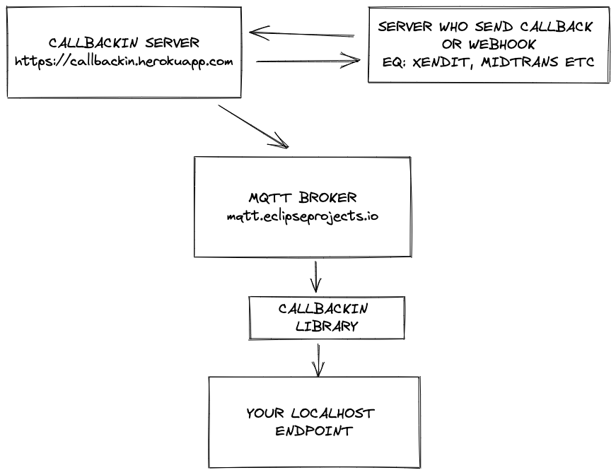

### CALLBACKIN
Callbackin a plugin for handling and interfacing a callback from server to localhost.

### HOW IS Works?
Callbackin is a plugin for handling and interfacing a callback from server to localhost using mqtt.



when server send a callback to https://callbackin.herokuapp.com/{your randomstring} , server in heroku (callbackin server) will send a callback to localhost (callbackin library) via mqtt and the library will send same data and header to CALLBACKIN_LOCAL_ENDPOINT. 

if you want to use your own callbackin server you can see my server code in 
[github](https://github.com/ibrahim4529/callbackin-api)

### HOW TO USE

1. Create a new laravel app.
2. install this plugin.
    ```
    composer require liostech/callbackin
    ```
3. Add this line to your .env file:
    ```
    CALLBACKIN_LOCAL_ENDPOINT=http://localhost:8000/localendpoint
    CALLBACKIN_PUBLIC_PATH=randomstring
    ```
4. Run this command:
    ```
    php artisan callbackin:listen
    ```
5. Set your callback url to:
    ```
    https://callbackin.herokuapp.com/{your randomstring}
    ```
    